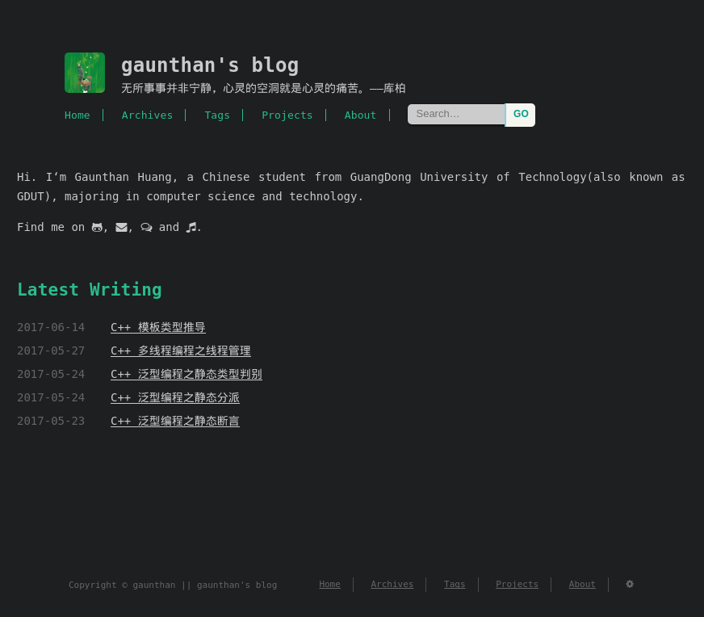
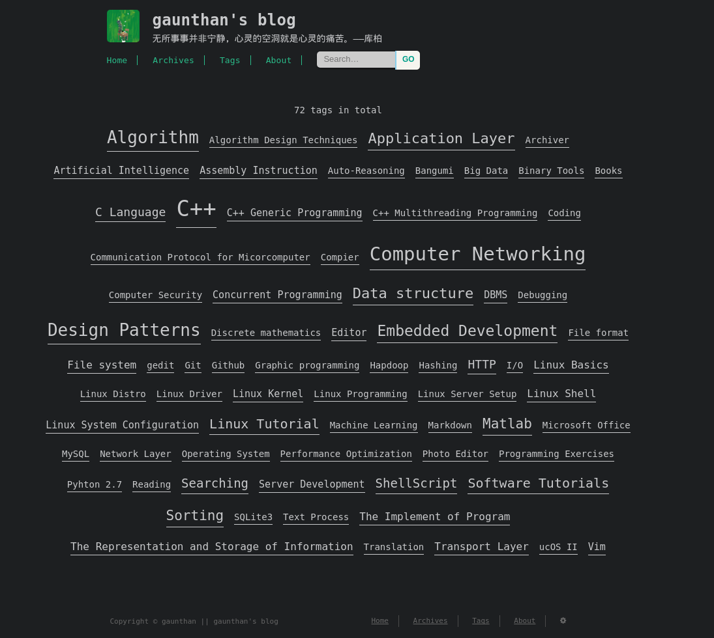
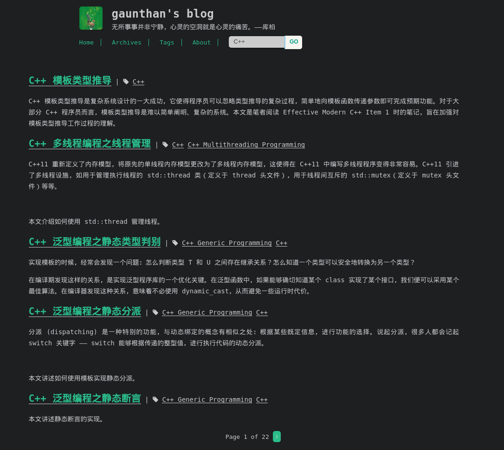
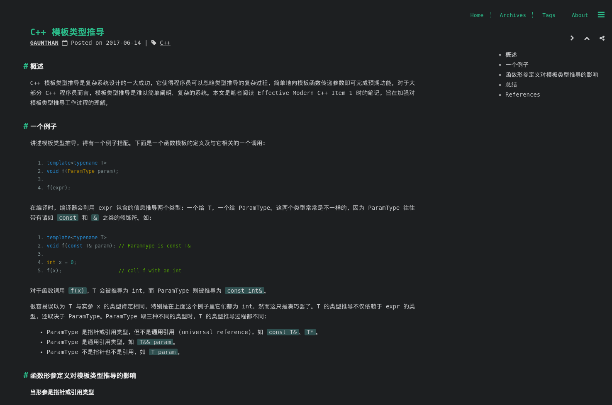
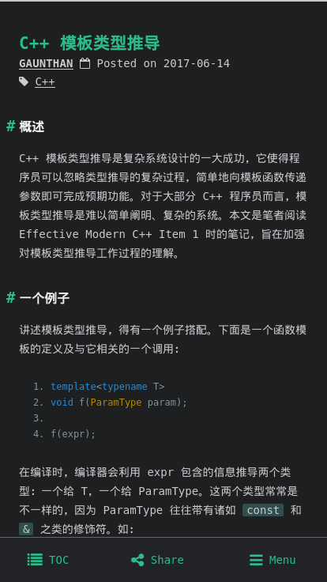

# Evenstar
Evenstar is a responsive, dark and simple blog theme for [Leanote](https://leanote.com), derived from [cactus-dark](https://github.com/probberechts/cactus-dark), with many exciting new features.

[Demo](http://gaunthan.leanote.com).

## Main changes

- Porting to Leanote, using [Leanote blog API](https://github.com/leanote/leanote/wiki/leanote-blog-theme-api) to generate content.
- Leanote cates and singles support.
- Searching support with a beautiful bar. 
- Tag cloud support, automatically adjust tag appearance by posts it has.
- Automaticly fold/expand TOC navigator. 
- Solarized dark theme for code print.
- Reward support. Remember replacing source/images/qr-wechat.png and source/images/qr-alipay.png with your own QR-code. 
- Dark, simple 404 page. 
- ...

## More screenshots
### Tag cloud

### Abstract post

### Post with navigator

### Mobile view

## How to use
Firstly, you need to download this repo
    
    cd ~/Downloads
    git clone https://github.com/gaunthan/Evenstar
    cd Evenstar

For uploading Evenstar to your Leanote, you need to zip the ./source path to a file

    zip Evenstar.zip source -r
    
Then you can upload it on your [blog settings center](https://leanote.com/member/blog/theme).

## License
MIT.
